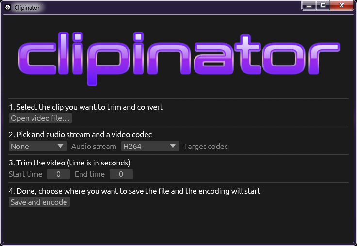

# Clipinator

## How does it work
This tool is a wrapper around ffmpeg and ffprobe that helps you trim, single out an audio track and transcode a clip (Discord for example can be really annoying to deal with if you're not giving it H264 video)

## Why did I make this tool
Basically I clip my games with OBS, and the replay buffer is 30 seconds. The interesting moment happening in the clip is not that long and more often than not I need to isolate the audio track that only contain the game's sound. 
I was tired of writing ffmpeg commands left and right and having a GUI that lets me choose the right settings quickly was the right thing to do.
The code is really quite messy (partially due to it using egui for its UI), but at least it WORKS.

## How do I use it?
Besides installing ffmpeg there's very little you need to do in order to use the app, as it's quite straightforward and everything is explained inside it.
If you encounter any bugs feel free to report them and I'll be glad to fix them even if you haven't provided a pull request.

## FFmpeg installation
Win + R > Powershell > `winget install ffmpeg`

## Will it be compatible with Linux
I made this app with Windows and AMD GPUs in mind, as it uses the proprietary AMF encoder on FFmpeg, it could work with Linux if I rewrote a few functions to accomodate for VAAPI and other Windows-related stuff but I didn't have that in mind since I (sadly) don't use Linux on my gaming PC anymore (you can blame kernel anticheat for that).
